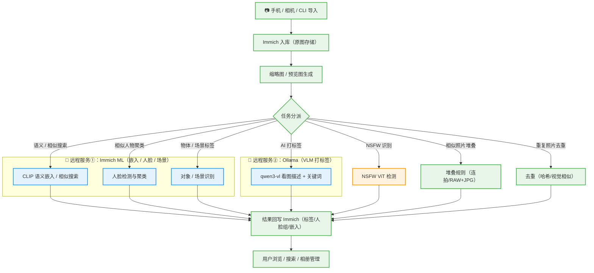

# Immich 照片管理 + 成人内容识别工作流

> 基于 Immich 自托管照片平台，构建 **成人内容（NSFW）识别、AI 打标签、相似人物/场景聚类、重复照片去重** 的完整处理流水线。
> 目录名 lmmich = Immich（照片管理）生态。

---

## 1. 总体架构

### 推荐架构（隐私优先）：NAS + Mac mini 本地算力

```
┌──────────────────────────────────────────────────────────────────┐
│ ① 导入层                                                          │
│   手机 / 相机 / 已有照片库 → Immich 上传（Web/CLI/自动备份）        │
└──────────────────────────┬───────────────────────────────────────┘
                           ▼
┌──────────────────────────────────────────────────────────────────┐
│ ② 基础智能分析（Immich ML，远程调用 Mac mini，MPS 加速）           │
│   • CLIP 嵌入       → 语义搜索、相似照片、智能搜索                 │
│   • 人脸识别+聚类   → ★ 相似人物自动分组（关键）                   │
│   • 对象检测 (YOLO) → 场景/物体标签（猫、汽车、海滩…）            │
└──────────────────────────┬───────────────────────────────────────┘
                           ▼
┌──────────────────────────────────────────────────────────────────┐
│ ③ 专项处理（按需触发）                                            │
│   • NSFW 识别    → helloxz/nsfw (ViT) → 自动标记/隔离相册         │
│   • AI 打标签    → VLM (Ollama@Mac) 描述+关键词 → 搜索可用        │
│   • 相似聚类     → 堆叠 (stack)：连拍/RAW+JPG/时间相近            │
│   • 照片去重     → 感知哈希/视觉相似 → 删除或归档                  │
└──────────────────────────┬───────────────────────────────────────┘
                           ▼
┌──────────────────────────────────────────────────────────────────┐
│ ④ 使用层                                                          │
│   相册/标签/智能搜索/人脸分组 浏览与管理（Web/手机 App）           │
└──────────────────────────────────────────────────────────────────┘
```

**部署拓扑（数据不出家门）**：

```
NAS（Synology，无 GPU）                  Mac mini M4 24GB（局域网，24/7）
├── Immich Server + 照片存储              ├── immich-machine-learning（原生 MPS）
├── NSFW 检测（CPU 轻量）                 │     CLIP + 人脸 + 对象检测
├── czkawka / immich-deduper 去重         └── Ollama qwen3-vl（原生 Metal）
└── immich-stack 堆叠                          AI 描述 + 关键词打标签
        │ 局域网（千兆，<1ms）
        └────────────────────────────────────► 只传缩略图，原图不出 NAS
```

> **为什么选 Mac mini 而非远程 GPU 服务器**：隐私 100%（数据不出局域网）、延迟 <1ms、
> 无带宽压力（缩略图 ~7KB/s 平均）、低功耗 24/7。Mac mini M4 对"慢慢处理"场景性能足够
> （5 万张：CLIP 1-2h / 人脸 4-14h / VLM 打标签 3-9 天）。
>
> **备选**：公司 2225（8×4090）可做临时快速批量处理（headscale 加密通道），
> 但存在数据出网 + 公司机器信任边界问题。

### 部署模式选择

| 模式 | 场景 | 命令 |
|:-----|:-----|:-----|
| **A. 全本地**（NAS 单机）| 无远程算力，能接受慢 | `deploy-immich.sh` |
| **B. NAS + Mac mini** ⭐ 推荐 | 隐私优先，家庭局域网 | 见下方 |
| **C. NAS + 远程 GPU**（2225）| 追求速度，接受出网 | `deploy-immich.sh --remote-ml <url> --remote-ollama <url>` |

```bash
# ⭐ 模式 B：NAS + Mac mini 部署步骤

# 第 1 步：Mac mini 上执行（原生安装算力端，Metal 加速）
bash scripts/lmmich/install-mac-worker.sh          # Ollama + Immich ML + launchd 常驻

# 第 2 步：NAS 上执行（ML/打标签指向 Mac mini，NAS 只跑存储+轻量任务）
bash scripts/lmmich/deploy-immich.sh \
  --remote-ml http://<mac-ip>:3003 \
  --remote-ollama http://<mac-ip>:11434
```

**性能参考（Mac mini M4 24GB，5 万张）**：

| 任务 | 单张耗时 | 总耗时 |
|:-----|:--------|:-------|
| NSFW ViT | 20-50ms | 30-40 分钟 |
| CLIP 嵌入 | 50-100ms | 1-1.5 小时 |
| 人脸检测 | 0.3-1s | 4-14 小时 |
| VLM 打标签（qwen3-vl:4b）| 5-15s | 3-9 天 |
| VLM 打标签（moondream 轻量）| 2-4s | 1-2 天 |

### 隐私与带宽说明

- **只传缩略图**（30-80KB/张），原图不出 NAS；5 万张总量 1.5-4GB，分摊到数天 ≈ 7KB/s，无带宽压力
- **局域网模式**（Mac mini）：数据不出家门，无截获面
- **远程 GPU 模式**（2225）：必须走 headscale/tailscale（WireGuard 端到端加密），密文传输不可截获；⚠️ 但照片临时数据会落在公司机器上，存在信任边界
- **不要**把照片走第三方 API 网关（如 new-api）处理 — base64 照片流经网关 = 隐私暴露

## 2. 完整处理流程（分阶段）

### 2.0 处理流程图（可视化）

> 颜色标记：🟢 本地（NAS 执行）| 🔵 远程（Mac mini / GPU 服务器）| 🟠 可本地可远程



> **两个远程服务的分工**：
> - **服务① Immich ML**（官方大脑）→ 输出**结构化数据**：嵌入向量、人脸分组、物体标签 — 驱动 Immich 的搜索/人物/智能相册
> - **服务② Ollama**（看图描述员）→ 输出**自然语言**：图片描述 + 搜索关键词 — 写入 description 字段，让搜索栏能搜"日落海滩红裙子"

**远程处理能力对照**：

| 流程 | 执行位置 | 可远程化 | 说明 |
|:-----|:---------|:---------|:-----|
| 导入 / 原图存储 | 🟢 NAS | ❌ 数据主权 | 原图不出 NAS |
| 缩略图生成 | 🟢 NAS | ❌ | Immich 本地 |
| CLIP 语义嵌入 | 🔵 Mac mini ML | ✅ 远程 | 只传缩略图，原图不外出 |
| 人脸检测与聚类 | 🔵 Mac mini ML | ✅ 远程 | 同上（计算量大，NAS CPU 太慢）|
| 对象 / 场景识别 | 🔵 Mac mini ML | ✅ 远程 | 同上 |
| AI 打标签 | 🔵 Mac mini Ollama | ✅ 远程 | VLM 必须远程（NAS CPU 太慢）|
| NSFW 识别 | 🟠 NAS 或远程 | ✅ 可选 | ViT 轻量，NAS CPU 即可；公网路径可用 batch |
| 相似照片堆叠 | 🟢 NAS | ❌ | 规则操作（文件名/时间）|
| 照片去重 | 🟢 NAS | ❌ | 本地哈希/文件系统操作 |
| 结果回写 | 🟢 NAS | ❌ | Immich 数据库本地 |

### 阶段 1：平台部署（前提）

```bash
# Immich 官方 Docker Compose（server + machine-learning + redis + postgres）
# 参考 https://immich.app/docs/install/docker-compose
# 关键环境变量:
#   UPLOAD_LOCATION=/data/immich          # 照片存储
#   MACHINE_LEARNING_ENABLED=true         # 启用 AI 分析
```

部署完成后在管理后台开启：
- **CLIP 模型**（ViT-B-32 或更大的 ViT-H-14 → 语义搜索更准）
- **人脸识别**（buffalo_l 模型 → 人脸检测+聚类）
- **对象检测**（YOLOv8 → 物体/场景标签）

> ⚠️ 人脸识别是"相似人物聚类"的核心 — **Immich 原生支持**，自动把同一个人物的照片聚为"人脸分组"，无需额外工具。

### 阶段 2：导入

```bash
# 方式一：手机 App 自动备份
# 方式二：CLI 批量导入已有照片库
docker exec immich-server immich upload --recursive /path/to/photos
```

### 阶段 3：NSFW 识别（成人内容标记）

```bash
# 部署 NSFW 检测服务（纯 CPU 即可）
docker run -d --name nsfw -p 6086:6086 --restart always \
  -e TOKEN=<你的密钥> helloz/nsfw

# 批量检测：脚本遍历 Immich 资产 → 调用 API → 返回 nsfw 系数
curl -X POST http://127.0.0.1:6086/api/upload_check \
  -H "Authorization: Bearer <TOKEN>" \
  -F 'file=@photo.jpg'
# 返回: {"data": {"sfw": 0.0014, "nsfw": 0.9986, "is_nsfw": true}}
```

**处理策略**（检测结果 → Immich 动作）：
- `nsfw >= 0.8` → 自动加入 `NSFW` 相册 / 打 `nsfw` 标签 / 移入隐藏相册
- `0.5 ~ 0.8` → 打 `疑似NSFW` 标签，人工复核
- 阈值可调（保守型模型建议 0.6-0.7 起步）

> ⚠️ 注意：`vit-base-nsfw-detector` 对 **AI 生成图片准确率较低**，真实照片/绘画效果好。若库中 AI 生成图占比高，需结合人工复核或换用更强模型。

### 阶段 4：AI 打标签（关键词 + 描述，让搜索可用）

```bash
# 方案 A（推荐）：timasoft/immich-analyze — Rust CLI/Docker，直接写 Immich 数据库描述
docker run -d --name immich-analyze ghcr.io/timasoft/immich-analyze:main \
  -e IMMICH_ANALYZE_MODE=combined \
  -e IMMICH_ANALYZE_INTERFACE=ollama \
  -e IMMICH_ANALYZE_HOSTS=http://ollama:11434 \
  -e IMMICH_ANALYZE_MODEL_NAME=qwen3-vl:4b-thinking-q4_K_M \
  -e IMMICH_ANALYZE_DATA_ACCESS_MODE=immich-api \
  -e IMMICH_ANALYZE_API_URL=http://immich-server:2283/api \
  -e IMMICH_ANALYZE_API_KEY=<API_KEY>

# 方案 B：seconion/immich-go-analyze — Go CLI，Ollama 模型（minicpm-v/moondream/qwen3-vl）
./immich-go-analyze   # 自动处理无描述的图片（每批 100 张）

# 方案 C（元数据写入，不依赖 Immich）：ImageIndexer (LLMII) — GUI 工具
#   KoboldCpp + VLM → 关键词/描述直接写入图片 EXIF/XMP（MWG:Keywords/MWG:Description）
#   适合：需要图片文件本身携带标签（可移植、不绑定 Immich）
```

**模型选择**（Ollama）：
| 模型 | 速度 | 质量 | 适用 |
|:-----|:-----|:-----|:-----|
| `moondream` | <1s | 基础 | 大批量快速打底 |
| `minicpm-v` | 2-4s | 良好 | 默认均衡 |
| `qwen3-vl:4b` | 中等 | 良好 | 推荐（打标签+描述）|
| `qwen3-vl:30b-a3b` | 快(MoE) | 高 | 4090 主力 |
| `qwen3-vl:14b/32b` | 慢 | 很高 | 精细标注 |

**一键选择模型**（部署脚本已内置预设）：
```bash
# Mac mini 部署（默认拉取 qwen3-vl:4b + moondream）
bash install-mac-worker.sh                          # 默认推荐组合
bash install-mac-worker.sh --preset mac             # 同上
bash install-mac-worker.sh --preset fast            # 只要 moondream（最快）
bash install-mac-worker.sh --model "qwen3-vl:7b moondream"   # 自定义

# NAS 部署时指定打标签模型
bash deploy-immich.sh --preset gpu                 # 4090: qwen3-vl:30b-a3b
bash deploy-immich.sh --model qwen3-vl:7b          # 自定义
```

### 阶段 5：相似聚类（堆叠）

```bash
# 方式一（原生）：Immich 智能搜索 → "相似照片" 自动检测（CLIP 相似度）
#   搜索 "stack" 或访问 duplicates 页面，手动/批量堆叠

# 方式二（规则化）：immich-stack — Go CLI，按文件名/时间/连拍序列自动堆叠
export IMMICH_URL=http://immich-server:2283/api
export IMMICH_API_KEY=<API_KEY>
export PARENT_FILENAME_PROMOTE=sequence        # 连拍序列做主图
./immich-stack --dry-run                        # 先试跑
./immich-stack                                  # 正式执行

# 方式三（轻量）：immich-auto-stack — Python/Docker，可 cron 定时
```

**堆叠策略**（针对"相似场景"）：
- 连拍/连爆（BURST、IMG_0001 序列）→ 自动堆叠
- RAW + JPG 同文件名 → 自动堆叠
- 时间相近（< 1 分钟）+ 同场景 → 手动确认堆叠

### 阶段 6：照片去重

```bash
# 方式一（原生）：Immich → 搜索 → Duplicates 页面（视觉相似检测，开箱即用）
# 方式二（精细）：immich-deduper — 感知哈希查找相似，支持阈值
docker run -it --rm ghcr.io/varun-raj/immich-deduper \
  --server-url http://immich-server:2283/api \
  --api-key <API_KEY> --similarity-threshold 0.95 --dry-run
# 方式三（兜底）：czkawka — 文件系统层面完全重复/相似文件
czkawka_gui    # 或 czkawka_cli duplicate -d /data/immich
```

**去重策略**：
- 完全重复（MD5 相同）→ czkawka 直接删
- 视觉近似（截图、连拍、尺寸变化）→ immich-deduper 阈值 0.9-0.95，先 dry-run 再删
- 删除前一律移入 Immich 回收站（Immich 原生支持，30 天可恢复）

### 阶段 7：整理与审核

- **人脸分组**重命名（Immich 人脸 → 命名"人物A"）→ 相似人物浏览
- **NSFW 相册**定期复核（疑似区间）
- 自动相册规则：`nsfw` 标签 → 隐藏相册；`去重保留` → 归档

---

## 3. 批量处理与性能优化（FIFO + 并发 + Batch）

> 几万张照片处理时，避免"逐张小文件传输 + 串行计算"的低效模式。

### 3.1 问题与可行性

| 任务 | 能否 Batch | 原因 |
|:-----|:----------|:-----|
| **NSFW 分类（ViT）**| ✅ 可以 | 分类器每张独立判断，N 张打包一次推理，无副作用 |
| CLIP 嵌入 | ✅ 已内建 | Immich ML 推理层本就是 batch（dataloader 批量 forward）|
| 人脸检测 | ✅ 已内建 | Immich ML 推理层 batch |
| **VLM 打标签** | ❌ 不能 | 多图放一个请求模型会当成"一个场景"混淆输出 — 每张必须独立请求（模型能力限制）|

**结论**：FIFO 队列全任务适用；Batch 只对 NSFW 值得显式做；其他任务用并发即可。

### 3.2 三层优化方案

**第 1 层：持久任务队列（FIFO，全任务通用）**

```
NAS:
  inbox/（待处理，FIFO）→ done/（完成）→ fail/（失败可重试）
  生产者: 照片导入/新照片检测 → 写入 inbox
  消费者: N 个 worker 并发消费（处理完移入 done/）
```

- 用文件系统目录做队列：零依赖、断点续传、重启不丢、进度可见
- 现成支持：immich-analyze `combined` 模式（监视目录）；NSFW 脚本自建 `inbox/ + xargs -P N`

**第 2 层：传输层优化（按路径）**

| 场景 | 优化 |
|:-----|:-----|
| 局域网（Mac mini）| RTT <1ms，传输开销可忽略 — **并发 worker 即可，无需 batch** |
| 公网（2225）| ① NSFW 用 batch 端点 ② HTTP keep-alive 连接复用（避免每张 TLS 握手）③ 并发 8-16 |

**NSFW Batch 服务**（唯一显式 batch，公网路径收益大）：
```
POST /batch_check  {"images": ["<b64>", ...32 张]}
→ ViT batch 推理 → 返回 32 个 {sfw, nsfw}
收益: 5 万张公网路径: 5 万请求 → ~1,600 请求（RTT 开销减 32 倍）
```

**第 3 层：任务层并发（解决串行）**

```
VLM 打标签（不能 batch，用并发流水线）:
  immich-analyze --max-concurrent 8     # 8 张同时在途（传输+推理重叠）
  → 5 万张 × 5s / 8 ≈ 4-8 小时，延迟不再累积

NSFW（batch + 并发）: worker 4-8，每 worker 发 batch(32)
CLIP/人脸: Immich ML workers 调 2-4（内建 batch 推理）
```

### 3.3 量化收益（5 万张，公网路径为例）

| 方案 | 传输请求数 | 传输开销 | 处理 |
|:-----|:-----------|:---------|:-----|
| 串行单张 | 50,000 | 30-60 分钟（RTT+握手）| 串行累积 |
| 并发 8（无 batch）| 50,000 | 5-8 分钟 | ✅ 主优化 |
| **并发 + NSFW batch(32)** | ~1,600 | <1 分钟 | ✅✅ 最优 |

> 局域网（Mac mini）路径无需 batch（RTT 忽略不计），并发即可；batch 主要针对公网（2225）路径。

---

## 4. 照片聚类（人物 / 场景 / 特征 / 位置）

### 4.1 聚类能力矩阵

| 需求 | Immich 原生 | 实现方式 | 结论 |
|:-----|:-----------|:---------|:-----|
| **同一个人不同场景** | ✅ 原生 | 人脸识别聚类（buffalo_l）→ 自动分组 → 命名后查看该人物全部照片（跨场景）| 开箱即用 |
| **同一个场景不同人** | ⚠️ 部分 | 无"场景聚类"概念；用 YOLO 物体标签 + CLIP 语义搜索（搜"海滩"）| 需脚本增强 |
| **给定相似特点**（颜色/风格/物体）| ⚠️ 部分 | CLIP 语义搜索原生可用；**自动聚类**需脚本 | 需脚本增强 |
| **位置聚类 + 地图展示** | ✅ 原生地图 | Immich **Map 视图**（GPS 打点）+ **Places**（反向地理编码）| 开箱即用 + 可增强 |

### 4.2 原生能力（开箱即用）

**① 人物聚类（同人不同场景）**
```
ML 人脸识别（buffalo_l）
   → 自动检测每张照片的人脸 → 按相似度聚类成"人物分组"（People）
   → 命名分组（如"张三"）→ 点击人物查看其所有照片（无论场景/时间）
```
- 启用：管理后台 → 机器学习 → 人脸识别（模型 buffalo_l，相似度阈值可调）
- 支持合并/拆分误分组（手动纠正）

**② 位置聚类 + 地图展示**
- **Map 视图**：设置 → 地图 → 照片按 GPS 坐标在地图上显示（按时间筛选）
- **Places（反向地理编码）**：GPS 坐标自动解析为地名（城市/州/国家）→ 可按地点搜索、生成地点聚类
  - 默认用公共 Nominatim（有请求限制）；照片多建议**自建 Photon/Nominatim** 或改 Immich reverse geocoding URL

**③ 语义搜索 + 智能相册（近似场景/特征聚类，零代码）**
```
搜索 "beach" / "生日" / "夜景" / "红色连衣裙" → CLIP 语义结果
→ 搜索结果可保存为"智能相册"（搜索规则持续生效）
```

### 4.3 自定义聚类脚本方案（Immich API + 嵌入向量）

对"任意特征自动聚类"，用 **Immich API + CLIP 嵌入 + DBSCAN/KMeans**：

```
GET /api/search/embedding          # 拉取全部资产的 CLIP 嵌入向量
   → 聚类算法:
      场景聚类: 向量相似 → "海滩组"、"室内聚会组"、"山景组"
      特征聚类: 颜色直方图/嵌入子空间 → "红色系"、"夜景"、"人像特写"
      位置聚类: 拉 exifInfo.gpsLatitude/gpsLongitude → DBSCAN（距离阈值 500m/2km）
   → POST /api/album 批量创建相册（或打标签）
```

```python
# 原型思路（NAS 上跑，可挂到 FIFO 队列之后）
import requests, numpy as np
from sklearn.cluster import DBSCAN

API = "http://localhost:2283/api"; KEY = "<api-key>"
emb = requests.get(f"{API}/search/embedding", headers={"x-api-key": KEY}).json()
vecs = np.array([e["embedding"] for e in emb])
labels = DBSCAN(eps=0.5, min_samples=5, metric="cosine").fit_predict(vecs)
# labels 相同 → 同一组 → 调 API 创建相册并加入资产
```

### 4.4 完整聚类流水线（与批量处理整合）

```
照片入库（GPS/EXIF）
   │
   ├─ 人脸聚类（原生）───────────► "人物A"分组（跨场景）      ✅ 自动
   ├─ 位置解析（原生 Places）────► 地点标签 + 地图展示        ✅ 自动
   ├─ CLIP 嵌入（远程 ML）───────► 语义搜索 + 智能相册        ✅ 自动
   └─ 自定义聚类脚本（可选）──────► 场景组 / 特征组 / 位置簇
           （拉嵌入 + DBSCAN → 批量建相册）                  🔧 扩展
```

---

## 5. 部署工具清单（最终推荐）

| 阶段 | 工具 | 类型 | 核心功能 | 备注 |
|:-----|:-----|:-----|:---------|:-----|
| 平台 | **Immich** | Docker 全家桶 | 照片管理 + ML 分析（CLIP/人脸/YOLO）| 基础，必装 |
| NSFW | **helloxz/nsfw** | Docker/API | ViT NSFW 系数检测 | 纯 CPU，HTTP API |
| 打标签 | **timasoft/immich-analyze** ⭐ | Docker/CLI | VLM 描述+关键词写 Immich | 比 immich-go-analyze 更成熟 |
| 打标签(备) | seconion/immich-go-analyze | CLI | Ollama 打标签 | 轻量 |
| 打标签(备) | ImageIndexer (LLMII) | GUI | VLM 写 EXIF/XMP 元数据 | 数据可移植，不绑 Immich |
| 聚类 | **Immich 原生堆叠** | 内置 | 视觉相似堆叠 | 开箱即用 |
| 聚类 | **immich-stack** | CLI | 规则堆叠（连拍/RAW+JPG/时间）| 自动化 |
| 去重 | **Immich 原生 Duplicates** | 内置 | 视觉相似检测 | 开箱即用 |
| 去重 | **immich-deduper** | CLI/Docker | 感知哈希精细去重 | 阈值可调 |
| 去重 | **czkawka** | GUI/CLI | 文件系统级重复清理 | 完全重复兜底 |
| 模型后端 | **Ollama** | Docker | VLM 推理（qwen3-vl/minicpm-v）| 打标签依赖 |

## 6. 你提供列表的评估

| 工具 | 结论 | 说明 |
|:-----|:-----|:-----|
| helloxz/nsfw | ✅ 合理 | 真实项目（ImgURL 作者开源），轻量可用；注意对 AI 生成图准确率低 |
| ImageIndexer | ✅ 合理 | 真实（358★），GUI + KoboldCpp；适合"元数据写入文件"场景，与 Immich 打标签互补 |
| immich-go-analyze | ✅ 合理 | 真实项目；**但推荐优先用 timasoft/immich-analyze**（Rust，功能更全：API/DB 双模式、监控模式、多模型）|
| immich-stack | ✅ 合理 | 真实（Majorfi/immich-stack），连拍/RAW+JPG 堆叠很好用 |
| Immich 原生去重 | ✅ 合理 | 开箱即用，但只标记不自动删 |
| immich-deduper | ✅ 合理 | 真实（varun-raj），阈值可调，精细去重主力 |
| czkawka | ✅ 合理 | 老牌可靠，文件系统级兜底 |

**列表总体合理 ✅，但有 2 个关键补充**：

1. **缺少 Immich Machine Learning 人脸识别** — "相似人物聚类"最核心的能力是**人脸分组**（Immich 原生 CLIP + buffalo_l 模型自动完成），这是列表里没有的
2. **缺少 Ollama 后端** — 所有 VLM 打标签工具（immich-analyze 等）都依赖 Ollama 或 llama.cpp，需要一并部署

## 7. 部署建议（Docker Compose 骨架）

```yaml
# docker-compose.yml（核心服务）
services:
  immich-server:
    image: ghcr.io/immich-app/immich-server:release
    volumes:
      - ${UPLOAD_LOCATION}:/usr/src/app/upload
    environment:
      - DB_HOSTNAME=immich-postgres
      - REDIS_HOSTNAME=immich-redis
      - MACHINE_LEARNING_ENABLED=true
    ports:
      - "2283:2283"

  immich-machine-learning:
    image: ghcr.io/immich-app/immich-machine-learning:release
    volumes:
      - model-cache:/cache
    # NVIDIA GPU: 加 deploy.resources.reservations 或 环境变量
    # 无 GPU 时设置 CPU 版（CLIP 仍可用，人脸识别较慢）

  immich-postgres:   # postgres:14 + pgvecto.rs
  immich-redis:      # redis:6.2-alpine

  # ── 扩展服务 ──
  nsfw:
    image: helloz/nsfw
    environment: [TOKEN=${NSFW_TOKEN}]
    ports: ["6086:6086"]

  ollama:
    image: ollama/ollama
    volumes: [ollama-data:/root/.ollama]
    ports: ["11434:11434"]
    # NVIDIA GPU: 加 reservations

  immich-analyze:
    image: ghcr.io/timasoft/immich-analyze:main
    environment:
      - IMMICH_ANALYZE_MODE=combined
      - IMMICH_ANALYZE_INTERFACE=ollama
      - IMMICH_ANALYZE_HOSTS=http://ollama:11434
      - IMMICH_ANALYZE_MODEL_NAME=qwen3-vl:4b-thinking-q4_K_M
      - IMMICH_ANALYZE_DATA_ACCESS_MODE=immich-api
      - IMMICH_ANALYZE_API_URL=http://immich-server:2283/api
      - IMMICH_ANALYZE_API_KEY=${IMMICH_API_KEY}
```

## 8. 硬件需求参考

| 组件 | 最低 | 推荐 |
|:-----|:-----|:-----|
| Immich ML（CLIP+人脸）| 8GB RAM，无 GPU | NVIDIA GPU 4GB+（人脸识别快 10x）|
| NSFW 检测 | 纯 CPU（轻量）| 同左 |
| Ollama VLM | 8GB RAM | GPU 8GB+（qwen3-vl:4b 可 CPU 跑）|
| 存储 | 照片库 1-2 倍空间 | SSD 更佳 |

> 现有环境可复用：公司 2225 容器（8×RTX4090）可跑 Ollama VLM 打标签 + Immich ML（GPU 4-7 空闲）；腾讯云可跑 NSFW（CPU）+ Immich 服务本身。

---

## 9. 相关链接

- Immich: https://immich.app / https://github.com/immich-app/immich
- helloxz/nsfw: https://github.com/helloxz/nsfw
- immich-analyze: https://github.com/timasoft/immich-analyze
- immich-go-analyze: https://github.com/seconion/immich-go-analyze
- ImageIndexer (LLMII): https://github.com/jabberjabberjabber/ImageIndexer
- immich-stack: https://github.com/Majorfi/immich-stack
- immich-deduper: https://github.com/varun-raj/immich-deduper
- czkawka: https://github.com/qarmin/czkawka
